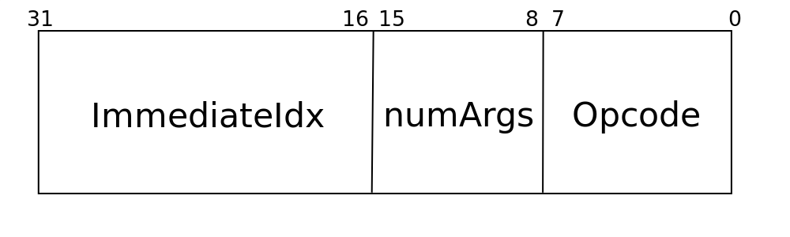

# Virtual Machine

## Build run and test
### Build
```
$ git clone --recurse-submodules https://github.com/OAMichael/VM-Course.git
$ cd VM-Course
$ cmake -B build -DCMAKE_BUILD_TYPE=Release && cd build
$ cmake --build .
```
### Run main program
```
$ cmake --build . --target run
```
### Run all tests
```
$ cmake --build . --target run_all_tests
```


## About the architecture of Virtual Machine

### General state
#### There are main components: `registers` and `memory`. This VM uses accumulator based ISA. Therefore, `accumulator` belongs to global state in addition to previous two components. 

#### Virtual Machine has `Interpreter` which executes all instructions from bytecode operating `registers`, `memory` and `accumulator`. `Interpreter` works with current frame. Frame consists of `PC` (**P**rogram **C**ounter), `registers` (256 per frame now) and pointer to parent frame.

#### Every time `Interpreter` goes into function a new frame is created. As long as function execution is going on the frame lives. After function execution has ended the frame is being deleted and execution of parent function continues. Every function is associated with its frame and every frame has its own set of `registers`. Functions can receive arguments from parent function. They are translated via first N `registers`. If function has `N` arguments, `registers` from `x0` to `x(N-1)` are copied from parent frame to current one. When function returns return value is stored in the `accumulator`.

#### There is an ISA of Virtual Machine. One can find full description of every instruction below.


### Registers
#### `Registers` are just cells of memory. Every `register` is 64 bits wide and can store objects or pointers to them. Objects are integers, floating point values or strings. `Register` can be considered as `union` of all mentioned above. There are 3 (by now) basic types of objects: 64 bit signed integer, 64 bit floating point number with double precision and string.


### Memory

#### Memory is large storage for bytecode and objects. Whole memory is divided into four regions:
- Instructions. This is the place where bytecode of program lives
- Constant pool. Here are all constants from source code
- String pool. All strings live here
- Memory arena. All dynamic objects are allocated here

#### Every instruction is 4 byte wide. Description of instructions can be found below the page. They are just stored in `instructions` region. Every program has `entrypoint`. This is the address of first instruction to be executed. Default `entrypoint` is 0 but if program contains `main` function then its address is the `entrypoint`.

#### Constants in `constant pool` have additional information. Every constant has its own basic type. If type is `integer` or `floating`, then value is taken straight from nearby. If type is `string`, then nearby value is pointer to string in `string pool`.

#### `String pool` contains strings. Every entry in the pool has information about length of the string and the string itself.

#### Arena allocator allocates memory in the `arena`. It is just simple carriage advancement which allows allocation dynamic objects.


### Accumulator
#### `Accumulator` is special `register` which is shared between all frames of a program. It can be considered as a mean of communication between functions as well as frames.


## Bytecode generation
### One can find examples and tests for pseudo assembly-language in directory `asm/tests`. To convert `*.asm` files into binary bytecode one should use `Asm2Bin` tool. Here is an example:
```
./Asm2Bin ../../asm/tests/arithmetic.asm
```

### Output:
```
Successfully translated the program: ../../asm/tests/arithmetic.asm
```


## Instruction Set Architecture (ISA)
### Here is full description of all supported instructions and their implementation.

### All instructions can be divided into several types: A, I, C, R, B, N, CALL, ALLOCA.

### Type A


#### It is the type of instructions which need only register. `r1` is an index of register to be used.

- LOAD_ACC
    
    Load value of `r1` into `accumulator`

    `acc` &larr; `r1`

- STORE_ACC

    Store value of `accumulator` into `r1`

    `r1` &larr; `acc`

- TO_FLOAT_REG

    Cast integer value of `r1` to floating point and store result into `accumulator`

    `acc.f_val` &larr; `(double)r1.i_val`

- TO_INT_REG

    Cast floating value of `r1` to integer and store result into `accumulator`

    `acc.i_val` &larr; `(int)r1.f_val`

- ADD

    Add integer value of `r1` to integer value of `accumulator` and store result into `accumulator`

    `acc.i_val` &larr; `acc.i_val + r1.i_val`

- SUB

    Subtract integer value of `r1` from integer value of `accumulator` and store result into `accumulator`

    `acc.i_val` &larr; `acc.i_val - r1.i_val`

- MUL

    Multiply integer value of `r1` with integer value of `accumulator` and store result into `accumulator`

    `acc.i_val` &larr; `acc.i_val * r1.i_val`

- DIV

    Divide integer value of `accumulator` by integer value of `r1` and store result into `accumulator`

    `acc.i_val` &larr; `acc.i_val / r1.i_val`

- AND

    Bitwise `AND` of integer value of `r1` and integer value of `accumulator` and store result into `accumulator`

    `acc.i_val` &larr; `acc.i_val & r1.i_val`

- OR

    Bitwise `OR` of integer value of `r1` and integer value of `accumulator` and store result into `accumulator`

    `acc.i_val` &larr; `acc.i_val | r1.i_val`

- XOR

    Bitwise `XOR` of integer value of `r1` and integer value of `accumulator` and store result into `accumulator`

    `acc.i_val` &larr; `acc.i_val ^ r1.i_val`

- SL

    Shift left integer value of `accumulator` by integer value of `r1` and store result into `accumulator`

    `acc.i_val` &larr; `acc.i_val << r1.i_val`

- SR

    Shift right integer value of `accumulator` by integer value of `r1` and store result into `accumulator`

    `acc.i_val` &larr; `acc.i_val >> r1.i_val`

- ADDF

    Add floating point value of `r1` to floating point value of `accumulator` and store result into `accumulator`

    `acc.f_val` &larr; `acc.f_val + r1.f_val`

- SUBF

    Subtract floating point of `r1` from floating point value of `accumulator` and store result into `accumulator`

    `acc.f_val` &larr; `acc.f_val - r1.f_val`

- MULF

    Multiply floating point value of `r1` with floating point value of `accumulator` and store result into `accumulator`

    `acc.f_val` &larr; `acc.f_val * r1.f_val`

- DIVF

    Divide floating point value of `accumulator` by floating point value of `r1` and store result into `accumulator`

    `acc.f_val` &larr; `acc.f_val / r1.f_val`


### Type I


#### It is the type of instructions which need only immediate value. `ImmediateIdx` is an index of constant in `constant pool` to be used. Type information is stored in the constant itself. Therefore, these operations support integer, floating point and for some even strings.

- LOAD_ACCI

    Load immediate value into `accumulator` (for types `integer`, `floating`, `string`)

    `acc` &larr; `imm` (for `integer` and `floating`)

    `acc` &larr; `imm.p_str` (for `string`)

- ADDI

    Add immediate value to `accumulator` and store result into `accumulator` (for types `integer`, `floating`)

    `acc` &larr; `acc + imm`

- SUBI

    Subtract immediate value from `accumulator` and store result into `accumulator` (for types `integer`, `floating`)

    `acc` &larr; `acc - imm`

- MULI

    Multiply immediate value with `accumulator` and store result into `accumulator` (for types `integer`, `floating`)

    `acc` &larr; `acc * imm`

- DIVI

    Divide `accumulator` by immediate value and store result into `accumulator` (for types `integer`, `floating`)

    `acc` &larr; `acc / imm`

- ANDI

    Bitwise `AND` of immediate value and integer value of `accumulator` and store result into `accumulator` (for type `integer`)

    `acc.i_val` &larr; `acc.i_val & imm`

- ORI

    Bitwise `OR` of immediate value and integer value of `accumulator` and store result into `accumulator` (for type `integer`)

    `acc.i_val` &larr; `acc.i_val | imm`

- XORI

    Bitwise `XOR` of immediate value and integer value of `accumulator` and store result into `accumulator` (for type `integer`)

    `acc.i_val` &larr; `acc.i_val ^ imm`

- SLI

    Shift left integer value of `accumulator` by immediate value and store result into `accumulator` (for type `integer`)

    `acc.i_val` &larr; `acc.i_val << imm`

- SRI

    Shift right integer value of `accumulator` by immediate value and store result into `accumulator` (for type `integer`)

    `acc.i_val` &larr; `acc.i_val >> imm`

- JMP

    Unconditional jump by given relative offset (for type `integer`)

    `pc` &larr; `pc + imm`


### Type C


#### It is the type of instructions which need neither register nor immediate and may possibly work only with accumulator.

- TO_FLOAT

    Cast integer value of `accumulator` to floating point and store result into `accumulator`

    `acc.f_val` &larr; `(double)acc.i_val`

- TO_INT

    Cast floating point value of `accumulator` to integer and store result into `accumulator`

    `acc.i_val` &larr; `(int)acc.f_val`

- NEG

    Negate value of `accumulator` and store result into `accumulator`

    `acc` &larr; `-acc`

- SIN

    Calculate sine of floating point value of `accumulator` and store result into `accumulator`

    `acc.f_val` &larr; `sin(acc.f_val)`

- COS

    Calculate cosine of floating point value of `accumulator` and store result into `accumulator`

    `acc.f_val` &larr; `cos(acc.f_val)`

- SQRT

    Calculate square root of floating point value of `accumulator` and store result into `accumulator`

    `acc.f_val` &larr; `sqrt(acc.f_val)`

- RET

    Return from function and delete its frame


### Type R


#### It is the type of instructions which need two registers.

- MV

    Copy value from `r2` to `r1`

    `r1` &larr; `r2`


### Type B


#### It is the type of instructions which need both register and immediate.

- MVI

    Copy value of `imm` to `r1`

    `r1` &larr; `imm`

- LOAD_ACC_MEM

    Load value of memory at position `r1 + imm` into `accumulator`

    `acc` &larr; `mem[r1 + imm]`

- STORE_ACC_MEM

    Store value of `accumulator` into memory at position `r1 + imm`

    `mem[r1 + imm]` &larr; `acc`

- BEQ

    Branch if values of `accumulator` and `r1` are equal

    `pc` &larr; `acc == r1 ? pc + imm : pc`

- BNE

    Branch if values of `accumulator` and `r1` are not equal

    `pc` &larr; `acc != r1 ? pc + imm : pc`

- BGE

    Branch if value of `accumulator` greater or equal than value of `r1`

    `pc` &larr; `acc >= r1 ? pc + imm : pc`

- BGT

    Branch if value of `accumulator` greater than value of `r1`

    `pc` &larr; `acc > r1 ? pc + imm : pc`

- BLE

    Branch if value of `accumulator` less or equal than value of `r1`

    `pc` &larr; `acc <= r1 ? pc + imm : pc`

- BLT

    Branch if value of `accumulator` less than value of `r1`

    `pc` &larr; `acc < r1 ? pc + imm : pc`


### Type N


#### It is the type of instructions for intrinsics. `intrCode` is the code of intrinsic. Here is the list of all intrinsics.

- SCAN

    Read integer value from stdin and store it into `accumulator`

    `acc.i_val` &larr; `(int)stdin`

- PRINT

    Write integer value of `accumulator` to stdout

    `stdout` &larr; `acc.i_val`

- SCANF

    Read floating point value from stdin and store it into `accumulator`

    `acc.f_val` &larr; `(double)stdin`

- PRINTF

    Write floating point value of `accumulator` to stdout

    `stdout` &larr; `acc.f_val`

- SCANS

    Read string from stdin, allocate memory for it in `string pool` and store its address into `accumulator`

    `str` &larr; `stdin`

    `acc.i_val` &larr; `&str`

- PRINTS

    Write string located in `string pool` at address stored in `accumulator` to stdout
    
    `str` &larr; `strPool[acc.i_val]`

    `stdout` &larr; `str`

- STRLEN

    Calculate length of string located in `string pool` at address stored in `accumulator` and store it into `accumulator`

    `str` &larr; `strPool[acc.i_val]`

    `acc.i_val` &larr; `length(str)`

- STRCAT

    Concatenate two strings located in `string pool` whose addresses stored in `x0` and `x1` registers and store address of newly allocated string into `accumulator`

    `str0` &larr; `strPool[x0.i_val]`

    `str1` &larr; `strPool[x1.i_val]`

    `str` &larr; `str0 + str1`

    `acc.i_val` &larr; `&str`

- SUBSTR

    Obtain substring of original string located in `string pool` at address stored in `accumulator` by indices stored in `x0` and `x1` registers and store address of newly allocated string into `accumulator`

    `str` &larr; `strPool[acc.i_val]`

    `substr` &larr; `str[x0.i_val, x1.i_val]`

    `acc.i_val` &larr; `&substr`


### Type CALL


#### It is the type of instruction for call a function. `numArgs` is the number of arguments of the function.

- CALL

    Call a function

    `parentFrame` &larr; `currFrame`

    `currFrame` &larr; `new Frame`

    `currFrame.parent` &larr; `parentFrame`

    `currFrame.pc` &larr; `parentFrame.pc`

    `currFrame.regfile[0, numArgs]` &larr; `parentFrame.regfile[0, numArgs]`


### Type ALLOCA


#### It is the type of instructions for dynamic object allocation at arena. `objType` is number repressenting basic object type.

- NEW

    Allocate new object of `objType` at arena and store its address into `accumulator`

    `acc` &larr; `new objType`

- NEWARRAY

    Allocate new array of objects of `objType` of size `acc.i_val` at arena and store its address into `accumulator`

    `acc` &larr; `new objType[acc.i_val]`